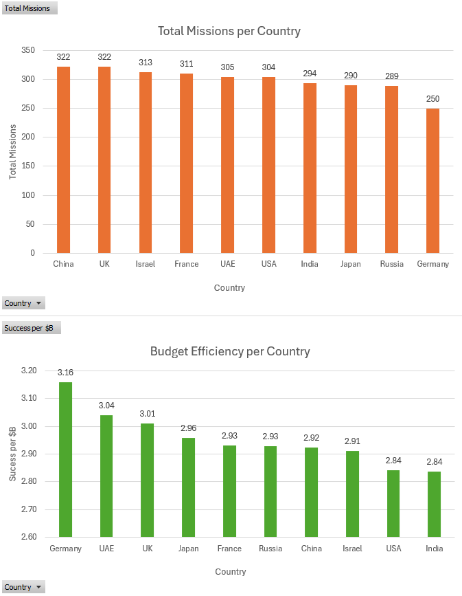
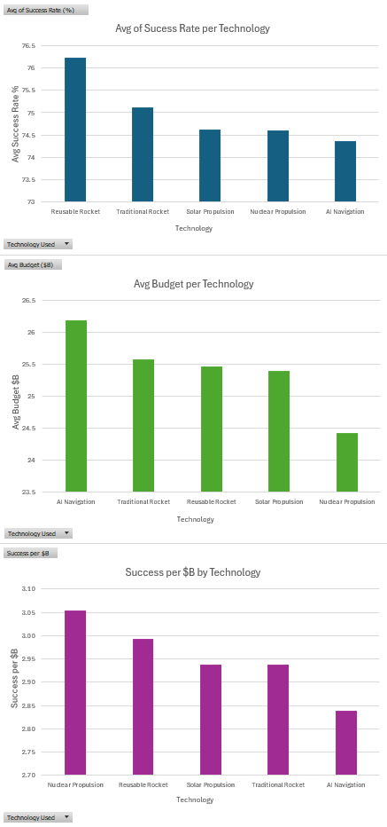
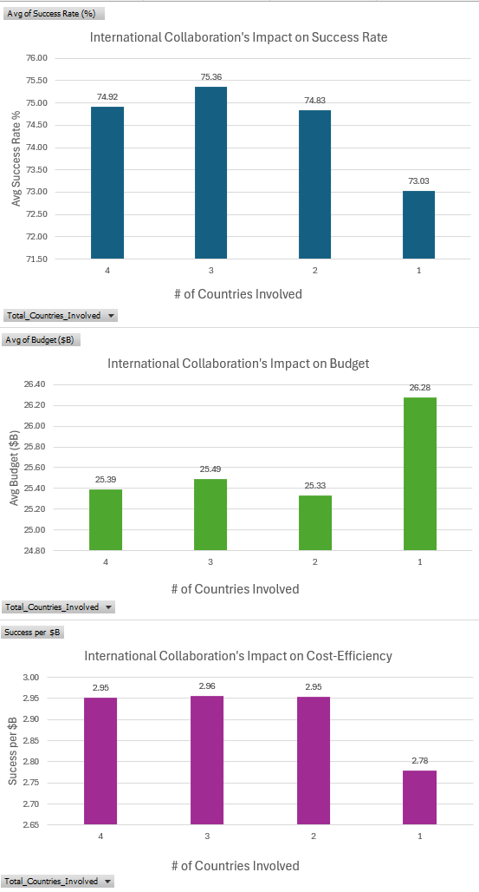
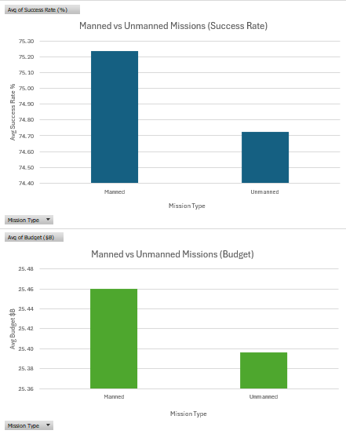
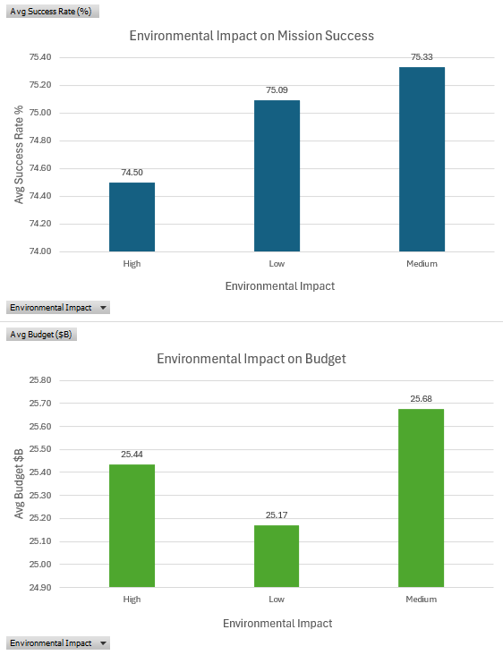
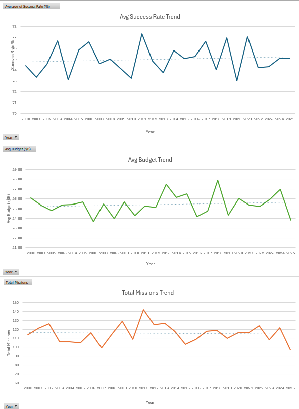
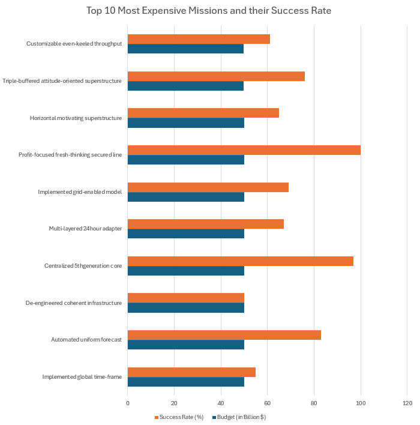
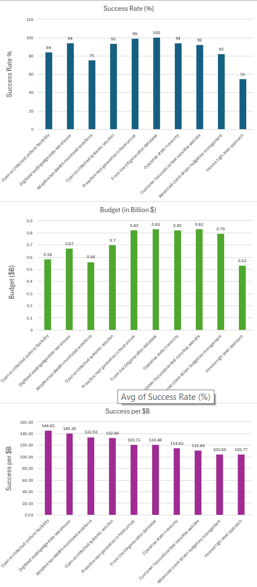

# Global Space Exploration Analysis

## Project Overview

**Objective:** Analyze 30 years of global space missions to identify trends in exploration strategy, budget efficiency, and mission success rates across countries and mission types.

**Dataset:** Global Space Exploration Dataset (3,000+ mission records across multiple countries and decades)

**Tools & Technologies:** SQL, Excel, Python, JavaScript, Data Visualization, AI-Assisted Development

**Repository:** [github.com/DavinAnalytics/global-space-exploration-analysis](https://github.com/DavinAnalytics/global-space-exploration-analysis)

> **[→ Live Interactive Dashboard](https://davinanalytics.github.io/global-space-exploration-analysis/space-dashboard/)**

---

## Table of Contents

- [Problem Statement](#problem-statement)
- [Data Source](#data-source)
- [Data Cleaning & Preparation](#data-cleaning--preparation)
- [Analysis & Insights](#analysis--insights)
- [Visualizations](#visualizations)
- [Interactive Dashboard](#interactive-dashboard)
- [Skills Demonstrated](#skills-demonstrated)
- [How to Reproduce](#how-to-reproduce)
- [Next Steps](#next-steps)

---

## Problem Statement

### What questions are we answering?

1. Which countries lead in space missions, and what's their efficiency?
2. Year-over-Year Performance Trends (Advanced: CTEs + Window functions — LAG for YoY changes)
3. Which technology delivers the best success rate + cost efficiency?
4. How do mission types (Manned vs Unmanned) differ in success rate and budget?
5. How do international collaborations impact success and duration?
6. What is the environmental impact by mission type/satellite type?
7. What are the most expensive missions and their results?
8. Ranking Analysis: Top 10 missions by cost-effectiveness (Success Rate per Billion $) (Window functions — RANK)

### Why does this matter?

In an era of intensifying global space competition and rapidly rising mission costs, understanding what drives success, cost-efficiency, and reliability is critical for space agencies and private companies alike.

This analysis provides actionable insights on optimal international collaboration strategies, technology effectiveness (e.g., reusable rockets vs. nuclear propulsion), and budget allocation which are directly relevant to organizations like SpaceX, Blue Origin, NASA, Northrop Grumman, and Boeing as they plan future lunar missions, Mars exploration, and satellite programs.

By identifying patterns in 3,000+ missions, this project demonstrates how data-driven decision making can reduce risk, improve cost-efficiency, and accelerate innovation in the aerospace industry.

---

## Data Source

**Dataset Name:** Global Space Exploration Dataset (2000-2025) by Atharva Soundankar

**Size:** 3,000 records, 12 columns

**Time Period:** 2000 - 2025

**Geographic Coverage:** China, France, Germany, India, Israel, Japan, Russia, UAE, UK, USA

**Source:** [Kaggle - Global Space Exploration Dataset](https://www.kaggle.com/datasets/atharvasoundankar/global-space-exploration-dataset-2000-2025)

> **Data Quality Note:**  
> The `Duration (in Days)` field contains many unrealistic low values (including numerous 1-day durations). Since this is a **synthetic dataset**, these values should be interpreted with caution; they likely do not represent actual full mission timelines.

**Columns Included:**
- Country
- Year
- Mission Name
- Mission Type
- Launch Site
- Satellite Type
- Budget (in Billion $)
- Success Rate (%)
- Technology Used
- Environmental Impact
- Collaborating Countries
- Total_Countries_Involved
- Duration (in Days)

---

## Data Cleaning & Preparation

**Status:** Completed

### Overview

I performed comprehensive data cleaning on the Global Space Exploration Dataset to ensure data quality and usability for analysis. This step was critical as the raw dataset contained several real-world inconsistencies typical of messy operational data.

### Key Issues Identified & Resolved

| Issue | Description | Resolution |
|-------|-------------|------------|
| Inconsistent `Collaborating Countries` | Main launching country was sometimes included, sometimes missing from the list | Developed custom `CASE` logic to **always include the launching `Country`** at the beginning of the list |
| Missing / Invalid Values | Empty cells imported as string `'nan'`, empty strings, and `NULL` values | Handled all variations using `IS NULL`, `TRIM()`, and string comparison |
| Extra Whitespace | Inconsistent formatting in text columns | Applied `TRIM()` across all text-based columns |
| Lack of Derived Metrics | No easy way to analyze level of international collaboration | Added new column `Total_Countries_Involved` using string functions |

### Cleaning Steps Performed

- Verified total row count and checked for duplicate records
- Conducted null/missing value analysis across all key columns
- Standardized text data using `TRIM()`
- Fixed `Collaborating Countries` logic using conditional `CASE` statements, `CONCAT()`, and `LIKE` operators
- Created calculated column `Total_Countries_Involved` (number of countries per mission)
- Added detailed documentation and comments in the SQL script

### Tools & Techniques Used

- **MySQL**
- SQL functions: `TRIM()`, `CONCAT()`, `CASE`, `LENGTH()`, `REPLACE()`
- Conditional logic for real-world data cleaning

**Full Cleaning Script:** [`sql/01_data_cleaning.sql`](sql/01_data_cleaning.sql)

---

## Analysis & Insights

### 1. Leading Countries in Space Missions and Their Efficiency

**Insight:**  
China and the UK lead significantly in mission volume with 322 missions each. However, the UK shows slightly better cost-efficiency.

**Supporting Data:**
- **China:** 322 missions, 74.99% avg success rate, $25.66B avg budget
- **UK:** 322 missions, 75.04% avg success rate, **$24.93B avg budget** (most efficient among top countries)

**Implication for Aerospace Industry:**  
This highlights strong competition from international players. Companies like SpaceX, NASA, and Blue Origin should focus on cost-efficiency strategies to maintain competitive advantage in the global market.

---

### 2. Year-over-Year Performance Trends

**Insight:**  
Mission volume and success rates have remained relatively stable over 25 years with moderate year-to-year fluctuations.

**Supporting Data:**
- Average missions per year: ~115
- Average success rate: ~75% (stable range: 72–78%)
- No strong long-term upward trend in success rate despite increasing budgets

**Implication:**  
Technological maturity appears more important than simply increasing spending. This supports sustained R&D investment rather than short-term budget spikes.

---

### 3. Technology Efficiency Comparison

**Insight:**  
Reusable Rocket technology has the highest success rate, while Nuclear Propulsion offers the best cost-efficiency.

**Supporting Data:**

| Technology Used | Avg Success Rate | Success per Billion | Cost-efficiency Rank |
|-----------------|------------------|---------------------|----------------------|
| Reusable Rocket | **76.23%** | 2.99 | 2 |
| Nuclear Propulsion | 74.60% | **3.05** | 1 |
| Solar Propulsion | 74.63% | 2.94 | 3 |

**Implication:**  
Hybrid approaches combining reusable systems with nuclear propulsion could deliver optimal results for future missions.

---

### 4. Mission Type (Manned vs Unmanned) and Their Success Rate and Budget

**Insight:**  
Manned missions have a slightly higher success rate than Unmanned missions, while cost-efficiency remains nearly identical.

**Supporting Data:**
- **Manned:** 1,528 missions, **75.23%** success rate, $25.46B avg budget
- **Unmanned:** 1,472 missions, 74.73% success rate, $25.40B avg budget

**Implication for Aerospace:**  
The additional complexity and cost of manned missions is justified by improved outcomes. This validates continued investment in crewed spaceflight programs.

---

### 5. How Do International Collaborations Impact Success and Duration?

**Insight:**  
Collaborations with 3 countries involved show the best balance of success rate and shorter mission duration. Solo missions have the lowest success rates.

**Supporting Data:**

| Countries Involved | Total Missions | Average Success Rate | Average Duration (days) | Average Budget ($B) | Success Rank | Duration Rank |
|--------------------|----------------|----------------------|-------------------------|---------------------|--------------|---------------|
| 1 (Solo) | **92** | 73.03% | **186** | **26.28** | 4 | 4 |
| 2 | 1,146 | 74.83% | 181 | 25.33 | 3 | 2 |
| 3 | 1,071 | **75.36%** | 180 | 25.49 | **1** | **1** |
| 4 | 691 | 74.92% | 183 | 25.39 | 2 | 3 |

**Implication for Aerospace:**  
This analysis strongly supports forming strategic partnerships. Collaborating with reliable partners can meaningfully improve mission success probability, reduce development timelines, and lower overall costs. This is especially valuable for complex, high-stakes programs such as lunar landings, Mars missions, or defense-related space projects.

---

### 6. Environmental Impact on Mission Success Rate and Budget

**Insight:**  
The environmental impact level has minimal overall effect on the mission success rate. Missions with medium environmental impact show slightly higher success rates, while high impact missions actually have the lowest success rate.

**Supporting Data:**

| Environmental Impact | Avg Success Rate | Avg Budget ($B) | Total Missions |
|----------------------|------------------|-----------------|----------------|
| High | 74.50% | 25.44 | 958 |
| Medium | **75.33%** | 25.68 | 1,032 |
| Low | 75.09% | **25.17** | 1,010 |

**Implication for Aerospace:**  
The environmental impact from the dataset does not appear to be a major driver of mission success or cost. This suggests that companies like SpaceX, NASA, and Blue Origin can pursue more sustainable missions without significantly sacrificing performance or increasing budgets. Sustainability and mission reliability can be optimized in parallel rather than as a trade-off.

---

### 7. Most Expensive Missions and Their Results

**Insight:**  
Even at the highest budget tier (~$50B), success rates vary dramatically (from 50% to 100%). This suggests that technology choice and execution matter more than raw budget.

**Supporting Data:**

| Mission Name | Country | Mission Type | Technology Used | Budget ($B) | Success Rate | Success per Billion |
|--------------|---------|--------------|-----------------|-------------|--------------|---------------------|
| Automated uniform forecast | France | Manned | AI Navigation | **49.97** | 83% | 1.66 |
| Implemented global time-frame | China | Manned | Traditional Rocket | **49.97** | 55% | 1.1 |
| De-engineered coherent infrastructure | Japan | Manned | Solar Propulsion | 49.93 | 50% | 1 |
| Centralized 5thgeneration core | Israel | Manned | Reusable Rocket | 49.92 | **97%** | **1.94** |
| Multi-layered 24hour adapter | USA | Unmanned | Solar Propulsion | 49.92 | 67% | 1.34 |

**Implication for Aerospace:**  
This highlights the risk of massive budget overruns without corresponding success guarantees. Focusing on proven technologies (like Reusable Rockets) and strong project management may deliver better outcomes than simply increasing spending.

---

### 8. Ranking Analysis: Top 10 Missions by Cost-Effectiveness

**Insight:**  
The highest cost-efficiency comes from **low-budget missions** that still achieve solid success rates.

**Supporting Data:**

| Rank | Mission Name | Country | Technology | Budget ($B) | Success Rate | Success per Billion |
|------|--------------|---------|-----------|------------|--------------|---------------------|
| 1 | Open-architected uniform flexibility | USA | Nuclear Propulsion | $0.58 | 84% | **144.83** |
| 2 | Digitized leadingedge data-warehouse | USA | Reusable Rocket | $0.67 | 94% | 140.30 |
| 3 | Adaptive bandwidth-monitored workforce | China | AI Navigation | $0.56 | 75% | 133.93 |

**Implication for Aerospace:**  
Lean and efficient missions are possible and should be used for technology demonstrations and smaller programs.

**Full analysis available in:** [`sql/02_exploratory_analysis.sql`](sql/02_exploratory_analysis.sql)

---

## Skills Demonstrated

### SQL Proficiency
- Data cleaning and validation
- Aggregate functions (COUNT, SUM, AVG, MAX, MIN)
- JOIN operations
- Window functions (RANK, ROW_NUMBER, LAG, LEAD)
- Common Table Expressions (CTEs)
- Subqueries and complex filtering

### Data Cleaning & Preparation
- Conducted full data quality checks (duplicates, nulls, and `'nan'` values)
- Standardized text columns using `TRIM()`
- Resolved inconsistent `Collaborating Countries` field using conditional logic (`CASE`, `CONCAT`, `LIKE`)
- Added derived column `Total_Countries_Involved` for better collaboration analysis
- Documented all steps in `sql/01_data_cleaning.sql`

### Analytical Thinking
- Formulating business questions
- Breaking down complex problems
- Data-driven insights
- Pattern recognition

### Visualization & Communication
- Creating clear, actionable charts
- Telling a data story
- Documenting findings for stakeholders

### Tools
- MySQL/SQL Database
- Python/Pandas
- Excel/Tableau/Power BI
- Git & GitHub

---

## Excel Analysis & Dashboard

**Status:** Completed  
**File:** [`Global_Space_Exploration_Excel_Dashboard.xlsx`](./excel/Global_Space_Exploration_Excel_Dashboard.xlsx)

I recreated all major insights from the SQL analysis in Excel using PivotTables, calculated fields, charts, and clear data storytelling.

### Key Visualizations

**1. Leading Countries in Space Missions**  


**2. Technology Efficiency Comparison**  


**3. International Collaboration Impact**  


**4. Manned vs Unmanned Missions**  


**5. Environmental Impact**  


**6. Year-over-Year Trends**  


**7. Top 10 Most Expensive Missions**  


**8. Top 10 Cost-Effective Missions**  


### Excel Skills Demonstrated

- Advanced PivotTables and Slicers
- Calculated Fields (e.g., Success per $Billion)
- Professional chart design and data visualization
- Insight generation and business storytelling
- Working with large datasets (3,000+ rows)

**Note:** Duration (in Days) was intentionally excluded from analysis due to unrealistic values in the synthetic dataset (as noted in the Data Quality section).

---

## Interactive Dashboard

**Status:** Completed  
**File:** [`space-dashboard/index.html`](./space-dashboard/index.html)  
**Live Demo:** *(deploy via GitHub Pages — see below)*

To extend the analytical findings beyond static charts, I leveraged AI-assisted development (Claude Code) to rapidly prototype and deploy a fully interactive web dashboard. This approach allowed me to translate the existing SQL and Excel insights into a stakeholder-ready, browser-based experience without a backend or external hosting dependency. The entire dashboard ships as a single self-contained HTML file.

### What It Covers

The dashboard surfaces all 8 analytical questions from the SQL analysis across five interactive sections:

| Section | Content |
|---------|---------|
| **Overview** | KPI summary cards, year-over-year trend chart (2000–2025), country mission volume and efficiency |
| **Countries** | Mission volume ranking, budget efficiency ranking, manned vs. unmanned split, environmental impact |
| **Technology** | Success rate and cost-efficiency comparison across all 5 propulsion technologies, ranked performance matrix |
| **Collaboration** | Impact of partnership size (1–4 nations) on success rate and budget |
| **Cost Analysis** | Top 5 most expensive missions vs. outcomes, top 10 missions ranked by cost-effectiveness (SQL `RANK()` logic) |

### Technical Implementation

- **Stack:** Vanilla JavaScript + Chart.js — no build step or server required; opens directly in any browser
- **Design:** Custom dark-panel aesthetic with a live mission telemetry ticker, monospace data typography, and color-coded success indicators
- **AI-Assisted Development:** Used Claude Code to accelerate the frontend build, demonstrating the ability to leverage modern AI tooling to deliver polished, stakeholder-facing artifacts efficiently alongside core data work

### Running the Dashboard

Open `space-dashboard/index.html` directly in Chrome or Edge (double-click or right-click → Open with browser). No installation required.

To host publicly via GitHub Pages:
1. Push this repository to GitHub
2. Go to **Settings → Pages → Deploy from branch → main**
3. The dashboard will be live at `https://<your-username>.github.io/<repo-name>/space-dashboard/index.html`

---

## Project Structure

```
global-space-exploration-analysis/
├── sql/
│   ├── 01_data_cleaning.sql
│   ├── 02_exploratory_analysis.sql
├── excel/
│   ├── Global_Space_Exploration_Excel_Dashboard.xlsx
│   └── excel_visualizations/
│       ├── countries_missions_chart.png
│       ├── technology_efficiency.png
│       ├── collaboration_impact.png
│       ├── mission_types.png
│       ├── environmental_impact.png
│       ├── space_mission_trends.png
│       ├── expensive_missions.png
│       └── cost_effective_missions.png
├── space-dashboard/
│   └── index.html          ← self-contained  
└── README.md
```

---

## Contact & Questions

**Author:** Davin Kim  
**GitHub:** [github.com/DavinAnalytics](https://github.com/DavinAnalytics)  
**LinkedIn:** [[LinkedIn profile link](https://www.linkedin.com/in/davinanalytics/)]

If you have questions about the analysis or data methodology, feel free to reach out!

---

## Acknowledgments

Dataset source: [Global Space Exploration Dataset (2000-2025) by Atharva Soundankar](https://www.kaggle.com/datasets/atharvasoundankar/global-space-exploration-dataset-2000-2025)
